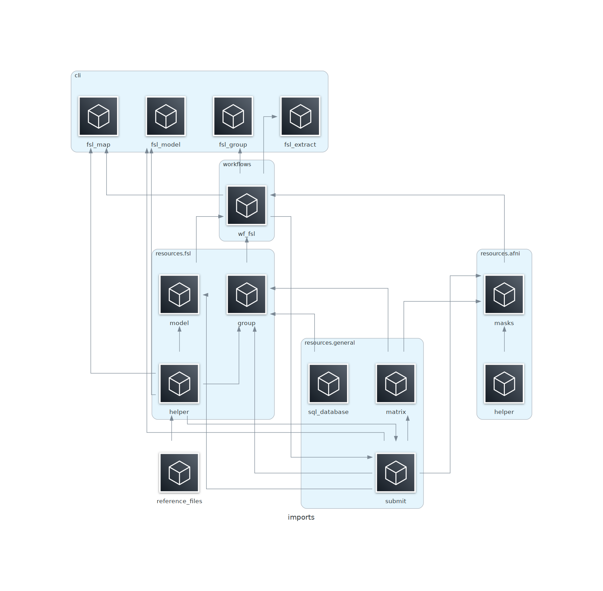

# func_model
This package contains workflows for modeling and extracting data from fMRI data. It contains two main divisions, resources for FSL-based pipelines (below) and resources for AFNI-based pipelines (largely deprecated, not reported here).

Sub-package/workflow navigation:
- [fsl_model](#fsl_model) : Conduct FSL-style first- and second-level regressions
- [fsl_extract](#fsl_extract) : Extract emotion betas from FSL first-level as a matrix
- [fsl_map](#fsl_map) : Make binary masks from classifier output
- [fsl_group](#fsl_group) : Generate required input for group-level analyses

Additionally, the workflow `fsl_model` is written to be executed on the Duke Compute Cluster (DCC) while the remaining three are written for labarserv2.


## General Usage
- Install package into project environment (on DCC or labarserv2) via `$python setup.py install`.
- Trigger general pakcage help and usage via entrypoint `$func_model`:

```
(emorep)[nmm51-dcc: ~]$func_model

Version : 4.3.0

The package func_model consists of sub-packages that can be accessed
from their respective entrypoints:

    fsl_model    : Conduct FSL-style first- and second-level regressions
    fsl_extract  : Extract emotion betas from FSL first-level as a matrix
    fsl_map      : Make binary masks from classifier output
    fsl_group    : Generate required input for group-level analyses

Sub-packages written for Duke Compute Cluster (DCC):

    - fsl_model

Sub-packages written for labarserv2:

    - fsl_extract
    - fsl_map
    - fsl_group

```


## General Requirements
- The `fsl_model` workflow requires the global variable `RSA_LS2` to contain a path to an RSA key for labarserv2.
- The workflows `fsl_extract` and `fsl_map` require the global variabel `SQL_PASS` to hold the user password for the MySQL database `db_emorep`.

Example:

```bash
$echo "export SQL_PASS=foobar" >> ~/.bashrc
```


## fsl_model
This workflow conducts first- and second-level modeling using an FSL-based pipeline. It requires that preprocessed data already exists and is available on Keoki using the EmoRep derivatives structure (see [func_preprocess](https://github.com/labarlab-emorep/func_preprocess)).

A number of different models are supported:
* `sep` : Model the emotion stimulus and replay events separately
* `tog` : Model the emotion stimulus and replay events together
* `rest` : Model effects-of-no-interest in rsfMRI to produce cleaned residuals
* `lss` : Similar to `tog`, but each trial (emotion stimulus + replay) are modeled separately

Additionally, second-level modeling is possible for `sep` and `tog`, once first-level modeling has been conducted.


## fsl_extract

## fsl_map

## fsl_group


## Diagrams


### Module Imports
Diagram of imports.
